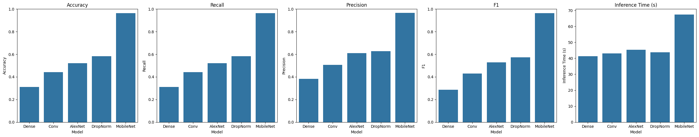
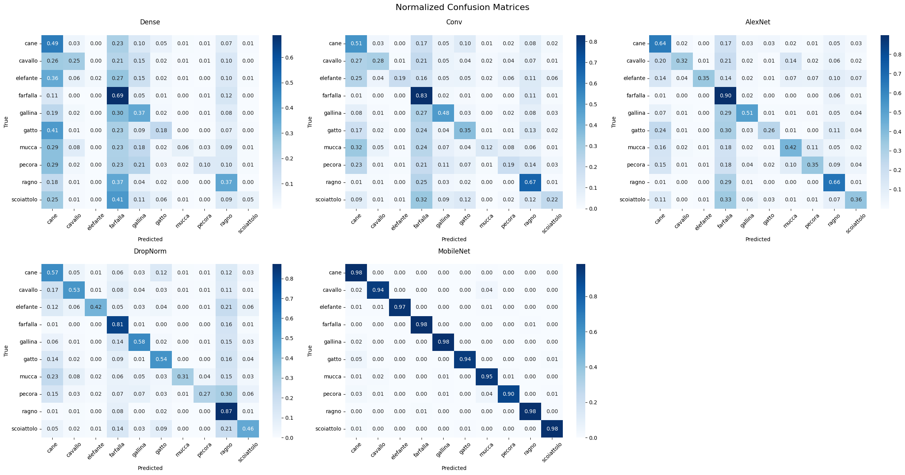

# Классификация изображений животных 🐶🐴🐘🦋🐔🐱🐄🐑🕷️🐿️
fastapi часть: https://github.com/Reape4er/fastapi_animal_classification
streamlit часть: https://github.com/Reape4er/Animal10-ai-classifier
## Содержание

1. [Описание проекта](#описание-проекта)
2. [Описание используемого датасета](#описание-используемого-датасета)
3. [Описание сравниваемых моделей](#описание-сравниваемых-моделей)
4. [Сравнение моделей](#сравнение-моделей)
5. [📦 Локальная установка проекта](#-локальная-установка-проекта)
6. [🔥 Быстрая проверка](#-быстрая-проверка)
7. [Развернутые сервисы](#развернутые-сервисы)
8. [Примеры использования API](#примеры-использования-api)

## Описание проекта

Этот проект посвящен задаче классификации изображений животных из датасета **Animal-10**.  
Модель определяет один из следующих 10 классов:

- Собака
- Лошадь
- Слон
- Бабочка
- Курица
- Кошка
- Корова
- Овца
- Паук
- Белка

Развернуты два сервиса:
- **FastAPI** сервер для обработки изображений и выдачи предсказаний.
- **Streamlit** веб-приложение для загрузки изображений и визуализации результатов.

---

## Описание используемого датасета

**Animal-10** — это коллекция изображений 10 различных животных. Датасет содержит разнообразные изображения в разных условиях освещения, ракурсах и разрешении, что делает задачу классификации более приближенной к реальным условиям.

---

## Описание сравниваемых моделей

| Модель | Описание |
|:------|:---------|
| **Dense модель** | Простая полносвязная нейронная сеть без сверточных слоев. |
| **Conv модель** | Небольшая сверточная нейронная сеть с несколькими слоями Conv2D. |
| **AlexNet-like модель** | Упрощенная версия архитектуры AlexNet, адаптированная под небольшой датасет. |
| **DropNorm модель** | Сверточная сеть с применением Dropout и Batch Normalization для борьбы с переобучением. |
| **MobileNet feature extractor** | Используется предобученная MobileNet (на ImageNet) для извлечения признаков, затем обучается классификатор на нашем датасете. |

---

## Сравнение моделей

### Метрики

### Матрица ошибок


---

## 📦 Локальная установка проекта

### 1. Клонируйте репозитории

```bash
# Клонирование FastAPI-сервера
git clone https://github.com/name/fastapi_animal_classification.git

# Клонирование Streamlit-приложения
git clone https://github.com/name/streamlit_classifire.git
```

---

### 2. Установка зависимостей

Перейдите в папку FastAPI проекта и установите зависимости:

```bash
cd fastapi_animal_classification
pip install -r requirements.txt
```

Откройте новый терминал (или вкладку) для Streamlit проекта:

```bash
cd streamlit_classifire
pip install -r requirements.txt
```

---

### 3. Запуск FastAPI сервера

В папке `fastapi_animal_classification` запустите сервер:

```bash
uvicorn app:app --reload
```

- Сервер по умолчанию запустится на `http://127.0.0.1:8000`
- Эндпоинт для предсказания будет доступен по адресу `http://127.0.0.1:8000/predict`

---

### 4. Запуск Streamlit-приложения

В другой вкладке терминала, находясь в папке `streamlit_classifire`, запустите приложение:

```bash
streamlit run streamlit_app.py
```

- Приложение будет доступно по адресу `http://localhost:8501`

---

### 5. Настройка URL FastAPI в Streamlit-приложении

**Важно!**  
В файле `streamlit_app.py` нужно убедиться, что URL FastAPI указывает на локальный сервер:

```python
FASTAPI_URL = "http://127.0.0.1:8000/predict"
```

---

## 🔥 Быстрая проверка

1. Перейдите на `http://localhost:8501`
2. Загрузите картинку через Streamlit-приложение
3. Нажмите кнопку "Классифицировать"
4. Увидите предсказанный класс и уверенность модели

---

## Развернутые сервисы

- **API (FastAPI)**: [https://fastapi-animal-classification-2.onrender.com/predict](https://fastapi-animal-classification-2.onrender.com/predict)
- **Streamlit-приложение**: [https://appclassifire-mkybxmemjcafcfop2akhl7.streamlit.app/](https://appclassifire-mkybxmemjcafcfop2akhl7.streamlit.app/)

---

## Примеры использования API

### POST `/predict`

**Запрос:**

```bash
curl -X 'POST' \
  'https://fastapi-animal-classification-2.onrender.com/predict' \
  -F 'file=@path_to_your_image.jpg'
```

**Ответ:**

```json
{
  "predicted_class": "кошка",
  "confidence": 0.9832
}
```

---
